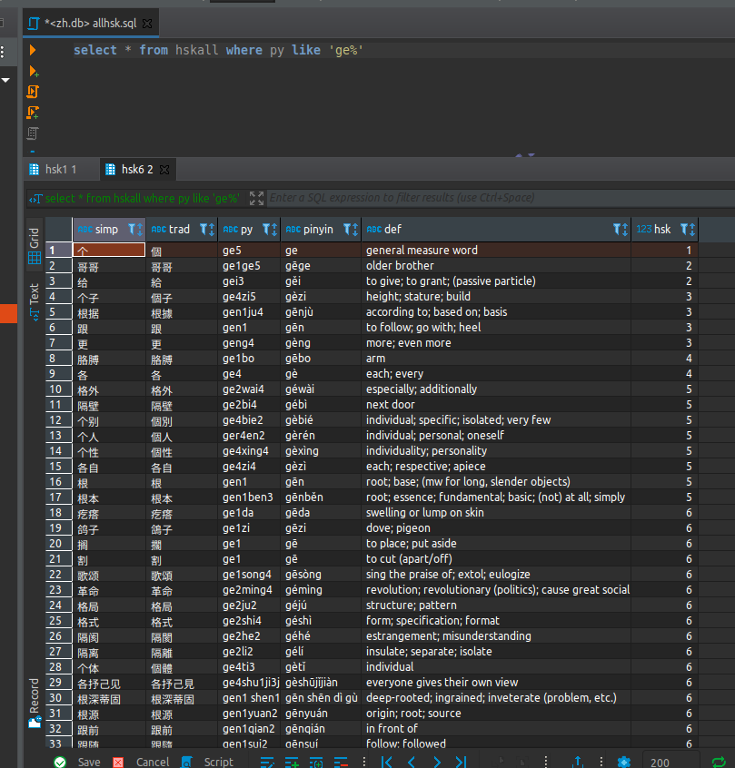

# HSK Words

This project contains a database of all the words on the HSK test, as well as some plain text files. The files (and tables) are broken down by level: hsk1, hsk2, etc

The original data for this came from here: https://github.com/glxxyz/hskhsk.com which came from here: https://www.mdbg.net/chinese/dictionary?page=cedict



## License

https://creativecommons.org/licenses/by-sa/4.0/

## Database

Each raw text file is it's own table in the database, and there is a view called `hskall` that unions all the tables together.

So you could do:

```sql
select * from hsk1 where py like 'ge%'
```

To get data from just the hsk level 1, or

```sql
select * from hskall where py like 'ge%'
```

To get data from all levels.

### Data import

The database was created by just importing each of the `raw` files:

```
$ sqlite zh.db
sqlite> .mode tabs
sqlite> .import ./raw/hsk1.txt hsk1
sqlite> .import ./raw/hsk2.txt hsk2
...
```
